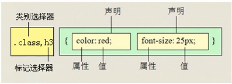
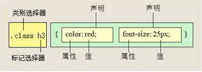
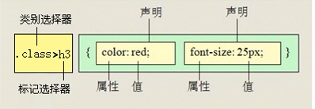
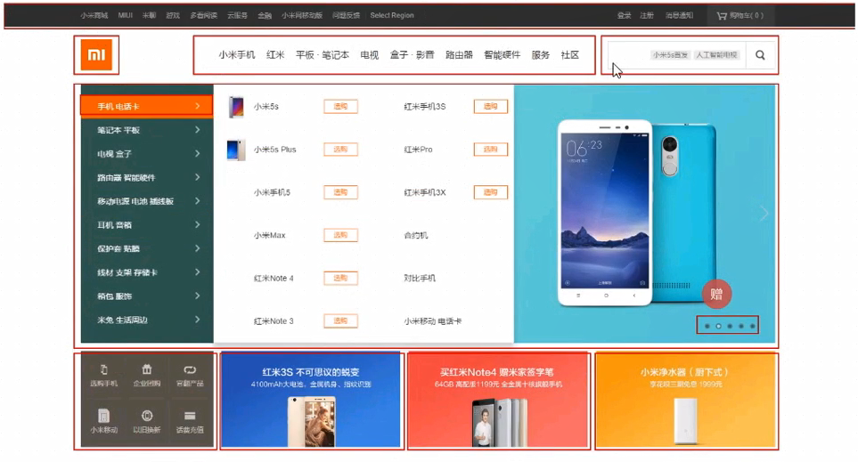
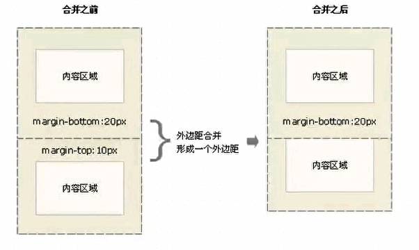
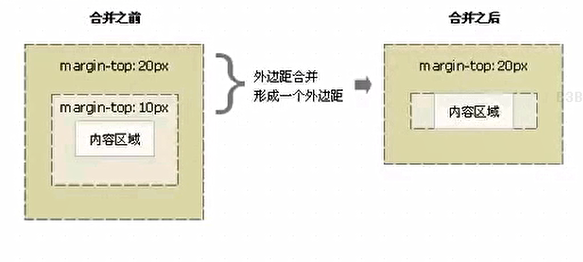

## css 字体样式属性
### 1、font-size：字号大小   
  font-size属性属于设置字号，该属性的值可以使用相对长度单位，也可以使用绝对长度单位。其中，相对长度单位比较常用，推荐使用像素单位px，绝对长度单位使用比较少。具体如下 ：   
  - em   相对当前对象文办的字体尺寸
  - px   像素，最常用，推荐使用
  - 绝对长度单位    
  - in   英寸
  - cm   厘米
  - mm   毫米
  - pt    点
### 2、font-family: 字体
 font-family属性用于设置字体，网页中常用的字体有宋体、微软雅黑、黑体等，列如：将网页中左右的段落文办的字体设置为微软雅黑，可以使用如下CSS样式代码：   
```
p {font-family: "微软雅黑"}
可以同时指定多个字体，中间以逗号隔开，表示如果浏览器不支持第一个字体，则会尝试下一个，直接找到合适的字体。
```
 > 常用技巧
 - 1、现在网页中谱表适用14px+。
 - 2、尽量使用偶数数字的字号，ie6等老式浏览器支持奇数会有bug。
 - 3、各种字体之间必须使用英文状态下的逗号隔开。
 - 4、中文字体需要佳音文状态下的引号，英文字体一般不需要加引号。当需要设置英文字体时，英文字体名必须位于中文字体名之前。
 - 5、如果字体名中包含空格、#、$等符号，则改字体必须加因为状态下的单引号或双引号，列如font-family："Times New Roman";
 - 6、尽量使用系统默认字体，保证在任何用户的浏览器中都能正确显示。


### 3、css unicode字体
1、在css 中设置 字体名称，直接写中文是可以的，但是在文件编码不匹配时会产生乱码的错误，xp系统不支持类似的微软雅黑的中文。   
解决办法   
 - 方案一：你可以直接使用英文来代替，比如font-family:"Microsoft Yahei"
 - 方案二：在css直接使用 Unicode 编码来写字体名可以避免这些错误，使用Unicode 写中文字体名称，浏览器是可以正确的解析的。
 - 微软雅黑： "\5FAE\8F6F\96C5\9ED1"
 - 宋体："\5B8B\4F53"
 ### 4、font-weight：字体粗细
- 字体加粗除了用b和strong标签以外，可以使用css来实现，但是css是没有语义的。   
```
1、font-weight属性用于定义字体的粗细，其属性值：normal、bold、bolder、lighter、100~900(100的整数倍)
```
> 小技巧：   
    数字400等价于normal，而700等价于bold。但是我们更喜欢用数字表示。

 ### 5、font-style：字体风格
   - 字体除了用i和em标签之外，可以使用css来实现，但是css没有语义的。
   - **font-size** 属性用于定义字体的风格，如设置斜体、倾斜或者正常字体，其可用属性值如下：
     - **normal**: 默认值，浏览器会显示标准的字体样式。
     - **italic**: 浏览器会显示倾斜的字体样式。（指定文本样式为斜体，对于没有设计斜体的特殊字体，如果需要使用斜体外观将应用oblique）
     - **oblique**： 浏览器会显示倾斜的字体样式（指定文本字体样式为倾斜的字体。人为的是文字倾斜）
     > 小技巧：
        ```   
       1、平时我们很少给文字加斜体，反而更喜欢给标签（em, i）改为普通模式
         ```   
### 6、font：综合设置字体样式(重点)
> font属性用于对字体样式进行综合设置，其基本语法格式如下：   
```
选择器 {font: font-style font-weight font-size/line-height font-family;}
```
```
 使用font属性是，注意必须按上面的语法格式中的顺序书写，不能更换顺序，各个属性以及空格隔开。
 注意：其阿红不需要设置的属性可以省略，但是必须保留font-size和font-family属性，否则font属性将不起作用
```
## css选择器
### 1、标签选择器(元素选择器)
 - 标签选择器是指HTML标签名称作为选择器，按标签名称分类，为页面中某一类标签你指定统一的CSS样式。其语法结构如下：
 ```
 标签名 {属性1：属性值1；属性2：属性值2；属性3：属性值3；} 或者
 元素名 {属性1：属性值1；属性2：属性值2；属性3：属性值3；} 
 ```
 标签选择器最大的优点就是能快速的为页面汇总的同类型的标签统一样式，同时这样是他的缺点，不能涉及差异化样式。
 ### 2、类选择器
 类选择器使用"."（英文点号）进行标识，后面紧跟着类名，其基本语法格式如下
 ```
 .类名{属性1：属性值1；属性2：属性值2；属性3：属性值3；}
 ```
```
标签调用的时候用class= "类名" 即可。
```
类选择器最大的优势是可以为元素定义单独的或相同的样式。
> 小技巧：
```
1、长名称或词组可以使用中横线来为选择器命名，
2、不建议使用"_"下划线来命名css选择器。
```
 输入的时候少按一个shift键；
 浏览器兼容问题（比如使用_tip的选择器命名，在IE6是无效的）
 能良好的区分JavaScript变量名（JS变量名是用："_"）
 ```
3、 不要纯数字、中文等命名，尽量使用英文字母来表示。
 ```
 名命规范：
    命名是我们通俗预定的，但是没有规定必须用这些常用的命名。   
注意： 
```
1、样式显示效果跟HTML元素中的类名先后顺序没有关系，受css样式书写的上下顺序有关。
2、各个类名中间用空格隔开
```
多类名选择器在后期布局比较复杂的情况下, 还是较多是使用的。
### 3、id 选择器
1、id选择器使用"#"进行标识，后面紧跟着id名，其基本语法格式如下：
```
#id名{属性1：属性值1;属性2：属性值2;属性3：属性值4;}
```
> 该语法中，id即为HTML的id属性值，大多数HTML元素都可以定义ID属性，元素的ID值是唯一的，只能对应于文档中某一个具体的元素，用法基本和类选择器相同。
#### id选择器和类选择器的区别
W3C标准规定，在同一个页面内，不允许有相同的名字id对象出现，但是允许相同名字的class。
- 类选择器好比人名，是可以多次重复使用的。
- id选择器好比人的身份证，全中国是唯一的，不得重复，只能使用一次。
> 类选择器和id选择器的区别在使用的次数少，id选择器只能使用一次，类选择器可以使用多次
### 4、通配符选择器
通配符选择器使用"*"来表示，它是所有选择器中作用范围最广的，能匹配页面中的所有元素。但是基本语法格式如下:
```
*{属性1：属性值1;属性2：属性值2;属性3：属性值3；}
```
列如下面代码，使用通配符定义css样式，清除所有的HTML标记的默认边距。   
*{margin: 0;/定义外边距 padding: 0;/定义内边距}   
**注意:**   
这个通配符选择器，就像我们电影明星中的梦中情人，想想它就好了,他不会跟你过日子，所以这个选择器，我们认识就好了，平时工作很少用。
### 5、伪类选择器
首先，这也是一个选择器，伪类选择器用于向某些选择器添加特殊的效果。比如给链接添加特殊效果，比如可以选择第一个，第n个元素。
```
为了和我们刚才学的类选择器相区别，类选择器是一个点，比如 .demo{},而我们的伪类选择器用两个点，就是冒号 比如 :link{}
```
#### （1）、链接伪类选择器
 - :link   `/*未访问的链接*/`
 - :visited   `/*已访问的链接*/`
 - :hover   `/*鼠标移动到链接上*/`
 - :active   `/*选定链接*/`   
 注意写的时候，他们的顺序尽量不要颠倒，按照lvha的顺序来写， love hate 记忆法，或者 lv 包包 非常hao   
 实际工作中,我们简单些链接伪元素选择器就好了
 ```
      a {   /*a 是标签选择器。所有的链接*/
          font-weight: 700;
          font-size: 16px;
          color: gray;
      }
      a:hover { /* : hover 是连接伪类选择器 鼠标经过*/
          color: orchid;  /* 鼠标经过颜色变成粉色 */
      }
      
 ```

 #### （2）、结构(位置)伪类选择器（css3新特性(有一些兼容性的问题)）
  - :first-child: 选取属于其父元素的首个子元素的指定选择器
  - :last-child: 选取属于其父元素的最后一个子元素的指定选择器
  - :nth-child(n)：匹配属于其父元素的第N个子元素，不论元素类型
  - 3n 0、3、6、9(n是从0开始)
  - :nth-last-child(n): 选择器匹配属于其元素的第N个子元素的每个元素，不论元素的类型，从最后一个子元素开始计数。n可以是数字、关键词或公式。 
#### （3）、目标伪类选择器
- :target 目标伪类选择器: 选择器可用于选取当前活动的目标元素
```
 :target {
      color: aquamarine;
      font-size: 30px;
    }
```
## 3、CSS外观属性
### 1、color：文本颜色
color属性用于定义文本的颜色，其取值方式有如下3种：
- 1、预定义的颜色值，如red, green, blue等
- 2、十六进制, 如#FF0000，#FF6600,#29D794等。实际工作中，十六进制是最常用的定义颜色的方式。
- 3、RGB代码，如红色可以表示为rgb(255,0,0)或者(100%,0%,0%)   
需要注意的是，如果使用RGB代码的百分比颜色值，取值为0时也不能省略百分号，必须写为0%
### 2、line-height:行间距
line-height属性用于设置行间距，就是行与行之间的距离，即字符的垂直间距，一般称为行高，line-height常用的属性值单位有三种，分别为
像素px,相对值em和百分比%，实际工作中使用最多的是像素px。
 > 最多比字体大7~8像素
### 3、text-align: 水平对齐方式
```
text-align 属性用于设置文本内容的水平对齐，相当于html中的align对其属性，其属性值如下
```
- left：左对齐(默认值)
- right: 右对齐
- center：居中对齐
### 4、text-indent: 首行缩进
 text-ident属性用于设置首行文本的缩进，其属性值可为不同的单位的数值、em字符宽度的倍数、或相当于浏览器窗口宽度的百分比%
 允许使用负值,建议使用em作为设置单位。1em等于一个中文字的宽度，2em等于首行缩进2个字符。
 ### 5、letter-spacing：字间距
 letter-spacing：属性用于定义字间距，所谓的字间距就是字符与字符之间的空白。其属性值可为不同单位的数值，允许使用负值，默认为normal。
 ### 6、word-spacing：单词间距
 - word-spacing：属性用于定义英文单词之间的间距，对于中文字符无效。和letter-spacing一样，其属性值可为不同单位的数值，允许使用负值，默认为normal
 - word-spacing和letter-spacing 均可对英文进行设置。不同的是letter-spacing定义的为字母之间的间距，而word-spacing定义为英文单词之间的间距。
 ### word-break：自动换行
 - normal 使用浏览器默认的换行规则
### 7、颜色半透明(css3)
文字颜色到了css3我们就可以采取半透明的格式语法如下：
```
color: rbga(r,g,b,a) a是alpha 透明的意思。color：rgba(0,0,0,0,0.3)
```
### 8、文字阴影(css3)
以后我们可以给我们的文字添加阴影效果了 Shadow 影子
```
text-shadow: 水平位置 垂直位置 模糊距离  阴影颜色；
```
- h-shadow: 必须。水平阴影的位置。允许负值
- v-shadow: 必须。垂直阴影的位置。允许负值
- blur：可选。模糊的距离
- color：可选。阴影的颜色。
> 前两必须填写，后两项可以选写。
## 4、引入css样式表(书写位置)
css可以写到那个位置？是不是一定要写到html文件里面呢？
### 1 行内样式(内联样式)
是通过标签的style属性来设置元素的样式，其基本语法格式如下:
```
<标签名 style="属性1：属性1; 属性2:属性2;属性3: 属性3">
```
语法中的style是标签的属性，实际上任何HTML标签都拥有style属性,用来设置行内样式。其中属性和值的书写
规范与css样式规则相同，行内样式只对其所在的标签及嵌套在其中的子标签起作用。
### 2 内部样式表（内嵌式）
内嵌式是将css代码集中卸载HTML文档的head头部标签中，并且用style标签定义，其基本语法格式如下：
```
<head>
   <style>
       选择器 {
            属性1: 属性值1;
            属性2: 属性值2;
            属性3: 属性值3;
        }
   </style>
</head>
```
语法中，style标签一般位于head标签中的title标签之后，也可以把它放在HTML文档的任何地方。   
type="text/css" 在html5中可以省略，写上也比较符合规范，所以这个地方可以省略。
### 3 外部样式表（外链式）
链入式是将所有的样式放在一个或多个以css为扩展名的外部样式表文件中，通过link标签将外部样式表文件链接到HTML文档中，
其基本语法格式如下:
```
<head>
  <link herf="css文件路径" type="text/css" rel="stylesheet">
</head>
```
注意: link 是个单标签哦！！！  
该语法中，link 标签需要放在head头部标签中，并且必须制定link标签的三个属性，具体如下:
- *-* herf: 定义所链接外部样式表文件的URL，可以是相对路劲，也可以是绝对路劲。
- *-* type：定义所链接文档的类型，在这里需要指定为"text/css",表示链接的外部文件类型为css样式表。
- *-* rel：定义当前文档与被链接文档之间的关系，在这里需要指定为"stylesheet",表示被链接的文档是一个样式表文件。   
### 4 三种样式表总结

| 样式表 | 优点 | 缺点 | 使用情况 | 控制范围|
| :--- | :----: | :----: |:----:|:----:|
| 行内样式表 | 书写方便,权重高 | 没有实现样式和结构分离 | 较少 | 控制一个标签(少) |
| 内部样式表    | 部分结构和样式相分离      | 没有彻底分离     |较多      | 控制一个页面(中)    |
| 外部样式表    | 完全实现结构和样式相分离      | 需要引入     |较多,强烈推荐      | 控制整个站点(多)    |

### 5 标签的显示模式（display）
标签的类型（显示模式）
HTML标签一般分为块标签和行内标签两种类型，他们也称块元素和行内元素。具体如下：
#### 块级元素(block-level)
每一个块级元素通常都会独自占据一整行或者多整行。可以对其设置宽度、高度、对其方式等属性，通常用于网页布局和网页结构的搭建。
```
常见的块级元素有  <h1>~<h6>、<p>、<div>、<ul>、<ol>、<li>等，其中<div>标签是最典型的块元素。
```
块级元素的特点：  
（1）总是从新开始。   
（2）宽度，行高、外边距以及内边距都可以控制。   
（3）宽度默认是容器的100%。   
（4）可以容纳内联元素和其他元素。   
#### 行内元素(inline-level)
行内元素不占有独立的区域，仅仅靠自身的字体大小和图片尺寸来支撑结构，一般不可以设置宽度、高度、对齐等属性，常用于控制
页面中文本的样式。
```
常见的行内元素有<a>、<strong>、<b>、<em>、<i>、<del>、<s>、<ins>、<u>、<span>等，其中<span>标签最典型的行内元素
```
行内元素的特点：   
（1）和相邻行内元素在一行上   
（2）高、宽无效，但水平方向的padding和margin可以设置   
（3）默认宽度就是它本身内容的宽度   
（4）行内元素只能容纳文本或则其他行内元素。(a特殊)    
注意：  
1、只有文字才能组成段落，因此p里面不能放块级元素，同理还有这些标签h1、h2、h3、h4、h5、h6、dt，他们都是文字类块级标签，里面不能放其他块级元素。   
2、链接里面不能再放链接。

### 块级元素和行内元素区别
```
 块级元素的特点：   
   （1）总是从新开始
   （2）高度，行高、外边距以及内边距都可以控制
   （3）宽度默认是容器的100%   
   （4）可以容纳内联元素和其他元素。
```
```
行内元素的特短：   
   （1） 和相邻行内元素在一行上。
   （2）高、宽无效，但水平方向的padding和margin可以设置 ，垂直方向的无效
   （3）默认宽度就是它本身内容的宽度。
```
## css复合选择器
复合选择器 是由两个或者多个基础选择器，通过不同的方式组合而成的，目的是为了可以选择更准确精细的目标元素标签。

### 1.1 交集选择器
交集选择器是有两个选择器构成，其中第一个为标签选择器，第二个为class选择器，两个选择器之间不能有空格，如h3.special。   
记忆技巧：   
- 交集选择器是并且的意思。即...又....的意思   
- 比如：p.one 选择的是：类名为.one的段落标签。   
- 用的相对来说比较少, 不太建议使用
### 1.2 并集选择器
并集选择器(css选择器分级)各个浏览器通过逗号链接而成的。任何形式的选择器(包括标签选择器、class类选择器、id选择器等)，
都可以作为并集选择器的一部分。如果是某些选择器定义的样式完全相同，或者部分相同，就可以利用并集选择器为它们定义相同的css样式。

   
记忆技巧：
 - 并集选择器 和的意思, 就是说, 只要逗号隔开的, 所有的选择器都会执行后面的样式
 - 比如 .one, p, #test {color: #F00} 表示.one 和 p 和 #test这三个选择器都会执行颜色为红色。通常用于集体声明。
 
 ### 1.3 后代选择器
 后代选择器又称为包含选择器，用来选择元素或者元素组的后代，其写法就是把外层的标签写在前面，内层的标签写在后面，中间用空格分隔。当标签发生嵌套时，内层标签就成为外层标签的后代。   
    
 子孙后代都是可以这么选择。或者说,他能选择任何包含在内的标签
 
 ### 1.4 子元素选择器
 子元素选择器只能选择作为某个子元素的元素。其写法就是把父级标签写在前面，子级标签卸载后面，
中间跟一个 `>` 进行连接， 注意, 符号左右两侧各保留一个空格。   
 
- 白话：这里的子 指的是亲儿子 不包括孙子 重孙子之类的。
- 比如：.demo > h3 {color: red} 说明h3 一定是demo 的亲儿子。demo 元素包含着 h3。
### 1.5属性选择器
选取标签带有某些特殊属性的选择器 我们称为属性选择器

| **选择器 |  **示例 | **含义 |
| :--- | :----: | :----: |
|E[attr]****| | 存在attr属性即可|
|E[attr=val]****| | 属性值完全等于Val|
|E[attr*=val]****| | 属性值里面包含val字符并且在"任意"位置|
|E[attr^=val]****| | 属性值里面包含val字符并且在"开始"位置|
|E[attr$=val]****| | 属性值里面包含val字符并且在"结束"位置|

```
/* 获取到  拥有  该属性的元素*/
  div[class^=font] {
      color: red;
    }
    div[class$=footer]{
      color: skyblue;
    }
    div[class*=tao] {
      color: chartreuse;
    }
```
```
    <div class="font12">属性选择器</div>
    <div class="font12">属性选择器</div>
    <div class="font24">属性选择器</div>
    <div class="font24">属性选择器</div>
    <div class="24font">属性选择器123</div>
    <div class="sub-footer">属性选择器footer</div>
    <div class="jb-footer">属性选择器footer</div>
    <div class="news-tao-nav">属性选择器</div>
    <div class="news-tao-header">属性选择器</div>
    <div class="tao-header">属性选择器</div>
```
### 1.6伪元素选择器(css3)
1. E::first-letter 文本的第一个单词或者字(如中文、日文、韩文等)
2. E::first-line 文本第一行;
3. E::selection 可改变选中文本的样式
```
 /* .demo 类选择器
  :first-child 伪类选择器
  ::first-letter 伪元素选择器*/
  p::first-letter {
    color: red;
    font-size: 50px;
  }
  p::first-line {
    color: green;
  }
  p::selection {
    color: pink;
  }
```
4、E::before 和 E:: after
在元素内部的开始位置和结束位置创建一个元素, 该元素为行为元素，且必须结合content属性使用。
```
div::before {
  content:'开始'
}
div::after {
  content:'结束'
}
```
E:after、E:before在旧版本里是伪元素，css3的规范里":"用来表示伪类，
"::"用来表示伪元素，但是在高版本的浏览器下E:after、E:before会被
自动识别为E::after、E::before,这样做的目的是用来兼容处理。   
E:after、E:before后面的练习中会反复用到，目前只需要有个大致了解  
":"与":"区别在于区分伪类和伪元素
## css书写规范
开始就形成良好的书写规范，是你专业化的开始。
### 1、空格规范
【强制】选择器与{之间必须包含空格  
示例：.selector {}   
【强制】属性名与之后的:之间不允许包含空格，：与属性值之间必须包含空格   
示例：font-size: 12px;
### 2、选择器规范
【强制】当一个rule包含多个selector时,每个选择器声明必须独占一行。
示例：
```
/*good*/
.post,
.page,
.content {
 line-heignt: 1.5;
}

/* bad*/
.post, .page, .comment {
 line-heignt: 1.5;
}
```
【建议】选择器的嵌套层级应不大于3级，位置靠后的限定条件因尽可能准确。
实例：
```
/*good*/
#username input{}
.comment .avatar{}

/* bad*/
.page .header .login #username input {}
.comment div * {}
```
### 3、属性规范
【强制】属性定义必须另起一行。
示例：
```
/*good*/
.selector {
  margin: 0;
  padding: 0;
}
/* bad*/
.selector {margin: 0; padding: 0;}
```
【强制】属性定义后必须以分号结尾。
## CSS 背景(background)
css 可以添加背景颜色和背景图片，以及来进行图片设置。

| background-color |
| :---: |
| background-image |
| background-repeat |
| background-position |
| background-attachment |
| background-attachment |
|背景的合写(复合属性) |
|background： 背景颜色 背景图片地址 背景平铺 背景滚动 背景位置  |
### 1、背景图片(image)
语法：
```
    background-image: url(../image/l.jpg);
```
### 2、背景位置(position)
语法：
```
backgroung-position: length || length
backgroung-position: position || position
```   
参数: 
length: 百分数| 由浮点数字和单位标识符组成的长度值，请参阅长度单位
positon：top|center|bottom|left|center|right   
说明：  
设置或检索对象的背景图像位置。必须先指定background-image属性。默认值为：(0%, 0%)。
如果只指定了一个值，该值将用于横坐标。纵坐标将默认为50%。第二个值将用于纵坐标。   
注意：
 1. position 后面是x坐标和y坐标。可以使用方位名词或者精确单位。
 2. 如果和精确单位和方位名字混合使用，则必须是x坐标前,y坐标后面，比如
 background-position：15px top;则15px 一定是x坐标，top是y坐标。   
 实际工作用的最多的，就是背景图片居中对齐了。
> 方位名词是没有顺序的，谁在前都一样，right bottom 和 bottom right 效果一样的   
>如果方位名词只写一个，另外一个默认为center(居中)
### 1.3 背景附着
语法：
```
  background-attachment: scroll | fixed
```
参数:    
  - scroll: 背景图像是随着对象内容滚动的
  - fixed: 背景图像固定   
说明：   
  设置或及检索背景图像是随着对象内容滚动还是固定的。
### 1.4 背景简写
 background 属性的值得书写顺序官方并没有强制标准的，为了可读性，建议大家如下写:   
 background: 背景颜色 背景图片地址 背景平铺 背景附着 背景位置
```
   background: transparent url(image.jpg) repeat-y scroll 50% 0;
```
### 1.5背景透明(css3)
css3支持背景半透明的写发生语句格式是:    
```
 background: rgba(0,0,0,0.3)
```
最后一个参数是alpha 透明度，取值范围 0~1 之间   
注意:   
   - 背景半透明是指盒子背景半透明，盒子里面的内容不受影响
   同样，可以给文字和边框透明 都是rgba的格式是来写。
### 1.6背景缩放(css3)
通过background-size 设置背景图片的尺寸，就像我们设置img的尺寸一样，在移动Web开发中做屏幕适配应用非常广泛。
其参数设置如下: 
- 可以设置长度单位(px)或者百分比(设置百分比时，参照盒子的宽高)
- 设置为cover, 会自动调整缩放比例, 保证图片始终填充背景区域，如有溢出部分则会被隐蔽。
- 设置为contain会自动调整缩放比例，保证图片始终完整显示在背景区域。
```
backgroud-image: url('images/gyt.jpg');
                 background-size: 300px 100px;
                /* background-size: contain;
                 background-size: cover;*/
```
### 1.7多背景(css3)
以逗号分隔开可以设置多背景，可以用自适应布局 做法就是 用逗号隔开就行了。
- 一个元素可以社做多重背景图像
- 每组属性间使用逗号分隔
- 如果设置的多重背景图之间存在着交集(即存在着重叠关系), 前面的背景图会覆盖在后面的背景图之上
- 为了避免背景将图像盖住，背景色通常都定义在最后一组上。
```
    width: 500px;
    height: 500px;
    background: url(../image/l.jpg) no-repeat left top,
    url(../image/3.jpg) no-repeat right bottom hotpink;
```
### 1.8 凹凸文字效果
```
  body {
      background-color: #ccc;
    }
    div {
      color: #ccc;
      font: 700 80px "微软雅黑";
    }
    div:first-child {
      /*text-shadow: 水平距离 垂直距离 模糊距离 阴影颜色;*/
      text-shadow: 1px 1px 1px #000, -1px -1px 3px #fff;
    }
    div:last-child {
      text-shadow: -1px -1px 1px #000, 1px 1px 3px #fff;
    }
```
### 1.9 文本的装饰
text-decoration 通常我们用于给链接修改装饰效果

| 值 | 描述|
| :---: |:---: |
| none | 默认。定义标准的文本|
| underline | 定义文本下的一条线，下划线，也是我们链接自带的|
| overline | 定义文本上的一条线|
| line-througt | 定义穿过文本下的一条线|

使用技巧： 在一行内的盒子内，我们设定行高的等于盒子的高度，就可以使文字垂直居中。
## css 三大特性
层叠 继承 优先级 是我们学习css 必须掌握的三个特征。
### 1、css层叠性
所谓的层叠性是指多种css样式叠加。   
是浏览器处理冲突的一个能力，如果一个属性通过两个选择器设置到同一个元素上，那么这个时候一个属性就会将另一个属性层叠掉。   
比如先给某个标签指定了内部文字颜色为红色，接着又指定了颜色为蓝色，此时出现一个标签指定了相同的样式不同的值得情况，这就是样式冲突。
一般情况下，如果出现了样式冲突，则会按照css书写顺序，以最后的样式为准。

css最后的执行口诀：长江后浪推前浪，前浪死在沙滩上。
### 2、css继承性
所谓继承性是指书写css样式表时，子标签会继承父标签的某些样式，如文本颜色和字号。想要设置一个可继承性的属性，只需将他应用于父元素即可。

简单的理解就是：子承父业。   

css最后的执行口诀：龙生龙。凤生凤，老鼠的儿子会打洞。


注意：    
恰当地使用继承性可以简化代码，降低css样式的复杂性。但是，如果在网页中所有的元素都大量继承样式，那么判断样式的来源来源就会很困难，所以
对于文字、文本属性等网页中通用的样式可以使用继承。列如字体、字号、颜色、行距等可以在body元素中统一设置，然后通过继承影响文档中所有的文本。

并不是所有的css属性都可以继承，例如，下面的属性就不具有继承性：边框、外边框、内边距、背景、定位、元素高属性。
### 3、css优先级
定义css样式时，经常出现两个或者更多规则应用在同一元素上，这时就会出现优先级的问题。   
在考虑权重时，初学者还需要注意一些特殊的情况，具体如下：
```
1、继承样式的权重为0，即在嵌套结构中，不管父元素样式的权重多大，被子元素继承时，他的权重都为0，
也就是说子元素定义的样式会覆盖继承来的样式。
2、行内样式优先。应用style属性的元素，其行内样式的权重非常高，可以理解为远大于100。总之,他拥有比上面提高的选择器都大的优先级。
3、权重相同时，css遵循就近原则。也就是说靠近元素的样式具有最大的优先级，或者说排在最后的样式优先级最大。
4、css定义了一个！imporrt命令，该命令被赋予最大的优先级。也就是说不管权重如何一级样式位置的远近，！import都具有最大的优先级。
```
### 4、css特殊性(specificity)
关于css权重，我们需要一套计算公式去计算，这个就是css Specificity，我们称为css特性或者非凡性，它是一个衡量css值优先级的一个标准，具体规范如下：   
specificity用于一个四位的数 字串(css2是三位)来表示，更像四个级别，值从左到右，左面最大，一级大于一级，数位之间没有进制，级别之间不可超越。

| 继承或者*的贡献值 | 0,0,0,0|
| :---: |:---: |
| 每个元素(标签)贡献值为 | 0,0,0,1|
| 每个类，伪类的贡献值为 | 0,0,1,0|
| 每个ID贡献值为 | 0,1,0,0|
| 每个行内样式贡献值为 | 1,0,0,0|
| 每个!import贡献值为 | ∞无穷大|

权重是可以叠加的 比如例子：

```
   div ul li  ------> 0,0,0,3
   .nav ul li  ------> 0,0,1,2
   a:hover  ------> 0,0,1,1
   .nav a  ------> 0,0,1,1
   #nav p  ------> 0,1,0,1
```
**注意**：    
1. 数位之间是没有进制的 比如说：0,0,0,5 + 0,0,0,5 = 0,0,0,10 而不是 0,0,1,0 ，所以不会存在10个div能赶上一个类选择器的情况。
2. 继承的权重是 0
总结优先级：
  1. 使用了 ！important 声明的规则。
  2. 内嵌在HTML元素的style属性里面的声明。
  3. 使用了ID选择器的规则。
  4. 使用了类选择器、属性选择器、伪元素和伪类选择器的规则。
  5. 使用了元素选择器的规则。
  6. 只包含一个通用选择器的规则。
  7. 同一类选择器则遵循就近原则。
```
 总结: 权重是优先级的算法，层叠是优先级的表现
```
## 盒子模型(css重点)
其实，css就三大模块：盒子模型、浮动、定位，其余的都是细节。要求这三部无论如何也要学的非常精通。

所谓的盒子模型就是把HTML页面中的元素看作是一个矩形的盒子，也就是一个盛装内容的容器。每个矩形都由元素的内容、内边距(padding)、
边框(border)和外边距(margin)组成。
### 1、网页布局的本质

看透网页布局的本质: 把网页元素比如文字图片等等，放入盒子里面，然后利用css摆放盒子的过程，就是网页布局。


css其实是没有太多的逻辑性可言的，类似我们小时候玩的积木，我们可以自由的，随意的摆放出我们想要的效果。
### 2、盒子模型(BoxModel)
这里略过 老旧的ie盒子模型(IE6以下),对不起，我都没见过IE5的浏览器。


首先，我们来看一张图，来体会下什么是盒模型。

所有的文档元素(标签)都会生成一个矩形框，我们称为元素框(element box),它描述了一个文档元素在网页布局汇总所占的位置大小。因此
，**每个盒子除了有自己的大小和位置外，还影响着其他盒子的大小和位置**

### 3、盒子边框(border)
边框就是那层皮，橘子皮。。柚子皮。。橙子皮。。   

语法： 
```
border：border-width || border-style || border-color
```
边框属性——设置边框样式(border-style)
 
边框样式用于定义页面中边框的风格，常用属性值人如下:

```
  none:     没有边框 即忽略所有边框的宽度(默认值)
 solid:     边框为单实线(最为常用的)
dashed:     边框为虚线
dotted:     边框为点线
double:     边框为双实线
```

#### 3.1、盒子边框写法总结表

|设置内容| 属性样式| 常用属性值|
|:---:|:---:|:---:|
|上边框|border-top-style: 样式;border-top-width: 宽度,border-top-color: 颜色，border-top: 宽度 样式 颜色；| |
|下边框|border-bottom-style: 样式;border-bottom-width: 宽度,border-bottom-color: 颜色，border-bottom: 宽度 样式 颜色；| |
|左边框|border-left-style: 样式;border-left-width: 宽度,border-left-color: 颜色，border-left: 宽度 样式 颜色；| |
|右边框|border-right-style: 样式;border-right-width: 宽度,border-right-color: 颜色，border-right: 宽度 样式 颜色；| |
|样式综合设置|border-style: 上边[右边 下边 左边];| none无(默认)、solid单实线、dashed虚线、dotted点线、double双实线 |
|宽度综合设置|border-width: 上边[右边 下边 左边];| 像素值|
|颜色综合设置|border-color: 上边[右边 下边 左边];| 颜色值、#十六进制、rgb(r,g,b)、rgb(r%,g%,b%)|
|边框综合设置|border: 四边宽度 四边样式 四边颜色;| |

#### 3.2、表格的细线边框

以前学过的html边框很粗，这里只需要css一句话就可以美观起来。让我们真的相信, css就是我们的白马王子(白雪公主)。
table{border-collapse:collapse},collapse单词是合并的意思

border-collapse:collapse; 表示边框合并在一起。

#### 3.3、圆角边框(css)
从此以后，我们的世界不只有矩形。radius(半径距离)

语法格式：   
```
border-radius: 左上角 右上角 右下角 左下角;
```
### 4、内边距(padding)
padding属性用于设置内边距。是指边框与内容之间的距离。

padding-top: 上内边距   
padding-right： 右内边距
padding-bottom： 下内边距
padding-left： 左内边距

注意： 后面跟着几个数值表示的意思不一样的。

|值得个数|表达意思|
|:---:|:---:|
|1个值|padding: 上下左右边距 比如 padding：3px;表示上下左右都是3像素|
|2个值|padding: 上下边距 左右边距 比如 padding：3px 5px;表示上下3像素 左右是5像素|
|3个值|padding: 上边距 左右边距 下边距 比如 padding：3px 5px 10px;表示上是3像素 左右是5像素 下是10px|
|4个值|padding: 上边距 左边距 右边距 下边距 比如 padding：3px 5px 10px 15px;表示上是3像素 右是5像素 下是10像素 做是15像素(顺时针)|

### 5、外边距(margin)
margin属性同于设置外边距。设置外边距会在元素之间创建"空白"，这段空白通常不能放置其他内容。   

margin-top：上外边距   
margin-right：右外边距   
margin-bottom：下外边距   
margin-left：左外边距   
margin：上外边距 右外边距 下外边距 左外边距    
取值顺序跟内边距相同

#### 外边距实现盒子居中
可以往一个盒子实现水平居中，需要满足以下两个条件:
 1. 必须是块级元素。
 2. 盒子必须指定了宽度(width)。

然后就给**左右的外部边距设置为auto**，就可以使块级元素水平居中。 
实际工作中常用的这种方式进行网页布局，示例代码如下：
```
.header {
  width:960px;
  margin: 0 auto
}
```  
注意：此处居中只针对于块级元素，行内元素以及行内块元素都是无效的。

#### 清除元素的默认内边距
为了方便的控制网页中的元素，制作网页时，可以用如下代码清除元素的默认内外边距。
```
* {
   margin: 0, 清除外边距
   padding: 0, 清除内边距
}
```
注意： 行内元素是只有左右内外边距的，是没有上下内外边距的。我们尽量不要给行内元素指定上下的内外边距就好了

### 6、外边距合并
使用margin 定义元素的垂直外边距时，可能会出现外边距的合并。
#### 相邻块级元素垂直外边距的合并
当上下相邻的朗格块级元素相遇时，如果上面的元素有下外边距 maigin-bottom ，下面的元素有上外边距margin-top，则他们之间的垂直距离不是margin-bottom 与margin-top之和，而是两者中较大者。
这种现象被称为相邻块级元素垂直外边的合并。(也称为外边距塌陷)。   

>解决方案: 避免就好了
#### 嵌套块元素垂直外边距的合并
对于两个嵌套关系的块级元素，如果父亲元素没有上边距以及边框，则父亲的上外边距会与子元素的上外边距发生合并，合并后的外边距为两者中的较大者，及时父元素
的上外边距为0，也会发生合并。(外边距塌陷)

> 解决方案：   
>  1. 可以为父元素定义1像素的上边距或上内边距
>  2. 可以为父元素添加overflow: hidden。
### 7、content宽度和高度
使用宽度属性width 和高度属性height 可以对盒子的大小进行控制。   
width和height的属性指可以为不同的单位的数值或相对于父元素的百分比%，实际工作中最常用的是像素值。   
大多数浏览器，如Firefoc、IE6及以上的版本都采用了W3C规范，符合CSS规范的盒子模型的总宽度和总高度的计算原则是：
```
 /*外盒尺寸计算(元素空间尺寸)*/
    Element空间高度 = content height + padding + border + margin
    Element空间宽度 = content width + padding + border + margin
 /*内盒尺寸计算(元素实际大小)*/
    Element空间高度 = content height + padding + border(height 为内容高度)
    Element空间宽度 = content width + padding + border(width 为内容宽度)
```
注意：
 1. 宽度属性width和高度属性height仅适用于块级元素，对行内元素无效(img标签和input标签除外)。
 2. 计算盒子模型的总高度时，还要考虑上下两个盒子垂直外边距合并(塌陷)的情况 
 3. **如果一个盒子没有改定宽度/高度或者继承父亲的宽度/宽度，则padding不会影响本盒子的大小**

### 盒子模型布局稳定性
开始学习盒子模型，同学们最大的困惑就是，分不清内外边距的使用，什么情况下使用外边距，什么情况下使用内边距？   
答案是： 其实大部分情况下是可以混用的。就是说，你用内边距也可以，用外边距也可以。你觉得那个方便就用那个。
但是总有一个最好用的吧，我们根据稳定性来分，建议如下：
按照优先使用宽度(width) 其次 使用内边距(padding) 再次外边距(margin)。
```
width > padding > margin
```
原因: 
  1.margin会有外边距合并 还有ie6下面margin加倍的bug(讨厌),所以最后使用。
